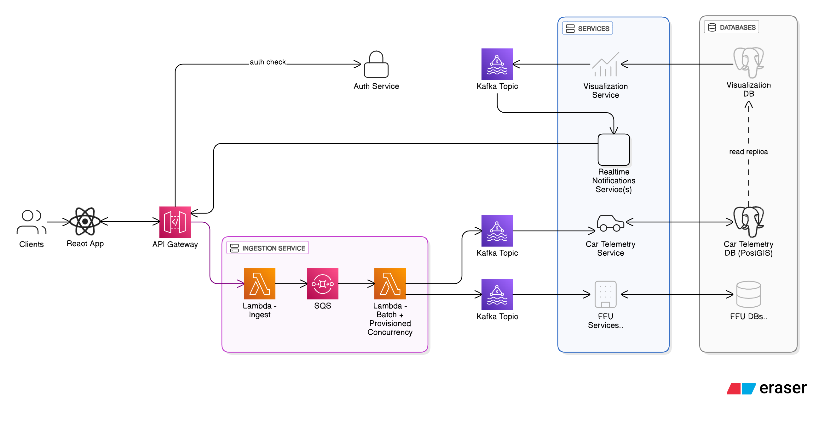

# OrgCarFleet

A car fleet management system (starter) built with AWS services, featuring event-driven architecture with Kafka and microservices for telemetry processing.

## Table of Contents

<!-- toc -->

- [Architecture](#architecture)
  - [Key Components](#key-components)
  - [Architecture Principles](#architecture-principles)
- [Services](#services)
  - [1. Ingestion Service](#1-ingestion-service)
  - [2. Car Telemetry Service](#2-car-telemetry-service)
  - [3. Realtime Notifications Service](#3-realtime-notifications-service)
- [Project Structure](#project-structure)
- [Quick Start](#quick-start)
  - [Prerequisites](#prerequisites)
  - [Deploy All Services](#deploy-all-services)
  - [Deploy Individual Services](#deploy-individual-services)

<!-- tocstop -->

## Architecture



### Key Components

1. **Frontend** - React SPA with Google OIDC via Cognito
2. **API Gateway** - HTTP API with Cognito authorizer
3. **Ingestion Service** - Serverless event ingestion (Lambda + SQS + Kafka producer)
4. **Kafka Cluster** - Event streaming backbone (self-managed on AWS EC2)
5. **Car Telemetry Service** - .NET microservice consuming telemetry events
6. **PostGIS Database** - PostgreSQL with geospatial extensions for location data
7. **Realtime Notifications Service** - .NET microservice for WebSocket-based real-time notifications

### Architecture Principles

- **Serverless-first**: Low cost at low traffic, auto-scaling at high traffic
- **Event-driven**: Decoupled services via Kafka topics
- **Resilient**: SQS buffering, DLQ handling, automatic retries
- **Geospatial**: PostGIS for efficient location queries and spatial indexing

## Services

### 1. Ingestion Service

Serverless API for event ingestion with authentication.

- **Stack**: AWS Lambda, API Gateway, SQS, Cognito
- **Function**: Validates requests, authenticates users, queues events to Kafka

📖 **[Ingestion Service Documentation](backend/ingestion-service/README.md)**

### 2. Car Telemetry Service

.NET microservice for processing vehicle telemetry data.

- **Stack**: .NET 8, Kafka Consumer, PostGIS, Docker
- **Function**: Consumes car events from Kafka, stores geospatial data in PostGIS

📖 **[Car Telemetry Service Documentation](backend/car-telemetry-service/README.md)**

### 3. Realtime Notifications Service

Horizontally scalable service for real-time notifications.

- **Stack**: .NET 8, Kafka Consumer, Redis, WebSockets
- **Function**: Consumes Kafka events, pushes notifications to frontend clients via WebSockets
- **Features**: Real-time notifications, session management, event broadcasting

📖 **[Realtime Notifications Service Documentation](backend/realtime-notifications/README.md)**

## Project Structure

```
OrgCarFleet/
├── backend/
│   ├── ingestion-service/          # Serverless event ingestion
│   ├── car-telemetry-service/      # Kafka consumer microservice
│   └── realtime-notifications/     # Realtime notification service (WebSocket)
├── frontend/                       # React SPA
│   ├── src/                        # React components
│   └── package.json
├── scripts/                        # Global deployment scripts
│   ├── build-and-deploy.sh         # Main orchestrator
│   ├── aws-config.sh               # AWS credentials
│   └── cognito-config.sh           # Cognito setup
└── README.md                       # This file
```

## Quick Start

### Prerequisites

- Node.js 20+ and npm
- .NET 8.0 SDK
- Docker and Docker Compose
- AWS CLI configured
- Kafka cluster (AWS EC2)
- PostgreSQL with PostGIS (AWS EC2)
- Redis (AWS EC2)

### Deploy All Services

```bash
./scripts/build-and-deploy.sh dev
```

### Deploy Individual Services

**Ingestion Service:**

```bash
./backend/ingestion-service/scripts/build-and-deploy.sh dev
```

**Car Telemetry Service**, **Realtime Notifications Service**:

```bash
./backend/<folder>/scripts/build-and-deploy.sh up
```

**Frontend:**

```bash
cd frontend
npm install
npm start
```
