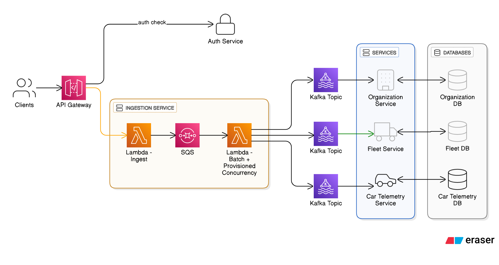

# OrgCarFleet

A serverless fleet management system built with AWS services, featuring event-driven architecture with Kafka and microservices for telemetry processing.

## Table of Contents

- [Architecture](#architecture)
- [Services](#services)
- [Project Structure](#project-structure)
- [Quick Start](#quick-start)
- [Development](#development)

## Architecture



### Data Flow

```
React Frontend → API Gateway + Cognito Auth → Ingestion Service (Lambda + SQS) →
Kafka → Car Telemetry Service (Kafka Consumer) → PostGIS Database
```

### Key Components

1. **Frontend** - React SPA with Google OAuth via Cognito
2. **API Gateway** - HTTP API with Cognito authorizer
3. **Ingestion Service** - Serverless event ingestion (Lambda + SQS + Kafka producer)
4. **Kafka Cluster** - Event streaming backbone (self-managed on AWS EC2)
5. **Car Telemetry Service** - .NET microservice consuming telemetry events
6. **PostGIS Database** - PostgreSQL with geospatial extensions for location data

### Architecture Principles

- **Serverless-first**: Low cost at low traffic, auto-scaling at high traffic
- **Event-driven**: Decoupled services via Kafka topics
- **Resilient**: SQS buffering, DLQ handling, automatic retries
- **Geospatial**: PostGIS for efficient location queries and spatial indexing

## Services

### 1. Ingestion Service

Serverless API for event ingestion with authentication.

- **Stack**: AWS Lambda, API Gateway, SQS, Cognito
- **Function**: Validates requests, authenticates users, queues events to Kafka
- **Topics**: `orgcarfleet-org-events`, `orgcarfleet-fleet-events`, `orgcarfleet-car-events`

📖 **[Ingestion Service Documentation](backend/ingestion-service/README.md)**

### 2. Car Telemetry Service

.NET microservice for processing vehicle telemetry data.

- **Stack**: .NET 8, Kafka Consumer, PostGIS, Docker
- **Function**: Consumes car events from Kafka, stores geospatial data in PostGIS
- **Features**: Real-time location tracking, spatial queries, telemetry analytics

📖 **[Car Telemetry Service Documentation](backend/car-telemetry-service/README.md)**

## Project Structure

```
OrgCarFleet/
├── backend/
│   ├── ingestion-service/          # Serverless event ingestion
│   └── car-telemetry-service/      # Kafka consumer microservice
├── frontend/                       # React SPA
│   ├── src/                        # React components
│   └── package.json
├── scripts/                        # Global deployment scripts
│   ├── build-deploy.sh             # Main orchestrator
│   ├── aws-config.sh               # AWS credentials
│   └── cognito-config.sh           # Cognito setup
└── README.md                       # This file
```

## Quick Start

### Prerequisites

- Node.js 20+ and npm
- .NET 8.0 SDK
- Docker and Docker Compose
- AWS CLI configured
- Kafka cluster (AWS EC2)
- PostgreSQL with PostGIS (AWS EC2)

### Deploy All Services

```bash
cd scripts
./build-deploy.sh dev
```

### Deploy Individual Services

**Ingestion Service:**

```bash
cd backend/ingestion-service/scripts
./build-deploy.sh dev
```

**Car Telemetry Service:**

```bash
cd backend/car-telemetry-service/scripts
./build-deploy.sh up
```

**Frontend:**

```bash
cd frontend
npm install
npm start
```

## Development

### Event Types

The system routes events to Kafka topics based on the `type` field:

- `type: "org"` → `orgcarfleet-org-events`
- `type: "fleet"` → `orgcarfleet-fleet-events`
- `type: "car"` → `orgcarfleet-car-events`

### Testing

**Send test event:**

```bash
curl -X POST https://YOUR_API.execute-api.REGION.amazonaws.com/dev/api \
  -H "Authorization: YOUR_ID_TOKEN" \
  -H "Content-Type: application/json" \
  -d '{"type": "car", "vehicleId": "CAR-001", "status": "available"}'
```

**Load testing:**

```bash
cd scripts
./load-test.sh https://YOUR_API_URL YOUR_ID_TOKEN
```

### Monitoring

- **API Gateway**: Latency, error rates
- **Lambda**: Duration, errors, throttling
- **SQS**: Queue depth, age of oldest message
- **Kafka**: Producer latency, consumer lag
- **PostGIS**: Query performance, storage size

### Security

- Cognito authentication with Google OAuth
- API Gateway authorizer validates tokens
- Kafka credentials in AWS Secrets Manager
- User context tracked in all events
