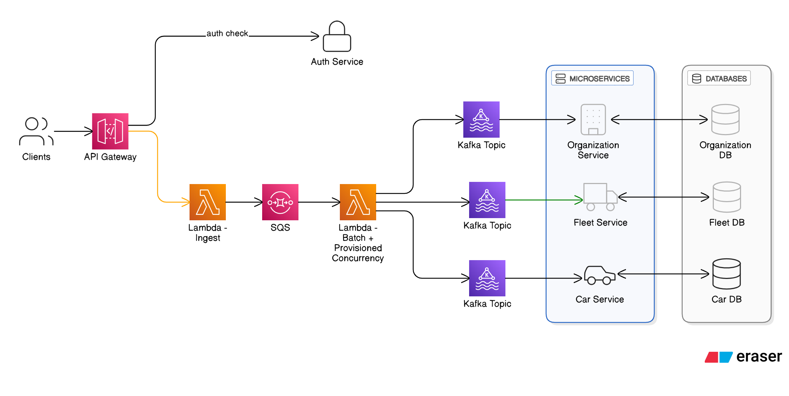

# OrgCarFleet

A serverless fleet management system built with AWS API Gateway, Google authentication via Cognito, Lambda, SQS, Kafka and Long-Running services (ECS/Fargate)

<!-- toc -->

- [Architecture](#architecture)
  - [High-Level Flow](#high-level-flow)
  - [Architecture Rationale](#architecture-rationale)
  - [Kafka Producer Configuration](#kafka-producer-configuration)
  - [Cost Considerations](#cost-considerations)
  - [Operational & Reliability](#operational--reliability)
  - [Migration Path](#migration-path)
- [Prerequisites](#prerequisites)
- [Project Structure](#project-structure)
- [Setup Instructions](#setup-instructions)
  - [1. Configure AWS Credentials](#1-configure-aws-credentials)
  - [2. Deploy Backend](#2-deploy-backend)
  - [3. Run Frontend](#3-run-frontend)
- [Usage](#usage)
  - [Example Request](#example-request)
  - [Response Format](#response-format)
- [Backend Flow](#backend-flow)
- [SQS Message Format](#sqs-message-format)
- [Development](#development)
  - [Backend Development](#backend-development)
  - [Frontend Development](#frontend-development)
  - [Testing API Locally](#testing-api-locally)
- [Security Considerations](#security-considerations)
- [Troubleshooting](#troubleshooting)
  - ["Unauthorized" Error](#unauthorized-error)
  - ["Failed to send request" Error](#failed-to-send-request-error)
  - [Google Sign-In Not Working](#google-sign-in-not-working)

<!-- tocstop -->

## Architecture



### High-Level Flow

```
React Frontend → API Gateway (HTTP API + Cognito Auth) → Lambda (validate/auth) → SQS Queue →
→ Lambda (batch producer, with Provisioned Concurrency) → Kafka → Long-Running services (ECS/Fargate)
```

This hybrid serverless architecture is designed for **high-scale ingestion** with low initial cost and the ability to scale efficiently:

1. **API Gateway (HTTP API)** - Handles incoming HTTP requests with Cognito authorization

2. **Cognito User Pool** - Manages Google OAuth authentication (shared with Summaries.AI)

3. **Ingestion Lambda** - Validates and authenticates requests, pushes events to SQS

4. **SQS Queue** - Durable message buffer for asynchronous processing and decoupling

5. **Batch Producer Lambda (with Provisioned Concurrency)** - Reads from SQS in batches and produces to Kafka topics

6. **Kafka Cluster** - High-throughput message streaming and event backbone (AWS MSK or self-managed)

7. **Long-Running services (ECS/Fargate)** - Consumes and processes messages from Kafka topics

### Architecture Rationale

- **Low initial cost**: Pay-per-invocation Lambda (no baseline infrastructure cost at low traffic)
- **Efficient batching**: SQS event source mapping batches up to 10,000 records/6 MB per Lambda invocation
- **Connection reuse**: Kafka producer initialized in Lambda global scope, reused across warm invocations
- **Decoupled & resilient**: SQS buffer protects against Kafka downtime; built-in retries and DLQ
- **Auto-scaling**: Lambda concurrency scales with SQS backlog; ECS/Fargate scales with consumer lag
- **Future-proof**: Route MQTT (AWS IoT Core) to same SQS queue without changing downstream components

### Kafka Producer Configuration

The batch producer Lambda should use optimized Kafka producer settings (initialized in global scope for reuse):

- **Batching**: `batch.size=16384`, `linger.ms=10-100` (tune based on latency requirements)
- **Compression**: `compression.type=snappy` or `lz4` for network efficiency
- **Acknowledgments**: `acks=1` (balance between durability and throughput) or `acks=all` for critical data
- **Idempotence**: `enable.idempotence=true` to prevent duplicates on retries
- **Partitioning**: Choose partition key strategy to avoid hot partitions and meet ordering needs
- **Connection Reuse**: Initialize producer in Lambda global scope to reuse across warm invocations

### Cost Considerations

| Traffic Level             | Ingestion Lambda | Batch Producer Lambda | Kafka Consumer (ECS/Fargate) | Total Monthly Cost (Est.) |
| ------------------------- | ---------------- | --------------------- | ---------------------------- | ------------------------- |
| **Low** (1K req/day)      | ~$0.20           | ~$0.10                | Optional (serverless only)   | **~$0.30**                |
| **Medium** (100K req/day) | ~$20             | ~$10                  | 1-2 Fargate tasks: ~$10      | **~$40**                  |
| **High** (10M req/day)    | ~$2000           | ~$1000                | 5-10 Fargate tasks: ~$75     | **~$3075**                |

_Note: Costs exclude Kafka cluster (MSK), SQS storage, and data transfer. Batch producer Lambda cost assumes efficient batching (10K records/invocation). Use AWS pricing calculator for precise estimates._

### Operational & Reliability

- **Monitoring**: Track API Gateway latency, ingestion Lambda duration, SQS queue depth, batch producer Lambda duration/errors, Kafka produce latency, consumer lag
- **Security**: Store Kafka credentials in AWS Secrets Manager; use TLS/SASL or IAM auth (MSK with IAM); rotate credentials regularly
- **DLQ Strategy**: Configure SQS DLQ for messages that fail after max retries from batch producer Lambda
- **Alerting**: Alert on high SQS queue depth, batch producer Lambda errors/throttling, Kafka connection failures, consumer lag
- **Lambda Configuration**: Set appropriate timeout (e.g., 5 minutes) and memory (512MB-1GB) for batch producer; enable reserved concurrency if needed

### Migration Path

1. **Start**: API Gateway HTTP API → Ingestion Lambda → SQS → Batch Producer Lambda → Kafka (fully serverless)
2. **Load Test**: Simulate expected RPS, measure end-to-end latency, SQS queue depth, Kafka produce latency, per-message cost
3. **Tune**: Adjust SQS event source mapping batch size (1-10,000 records), Lambda timeout, Kafka producer configs (linger.ms, batch.size, acks, compression)
4. **Add Consumers**: When downstream processing is needed, deploy ECS/Fargate consumers to read from Kafka topics
5. **Scale**: Monitor Lambda concurrency and SQS backlog; adjust reserved concurrency if needed; scale ECS consumers based on Kafka consumer lag
6. **Optimize**: Consider Savings Plans for predictable Lambda usage; use reserved instances for ECS/Fargate at high scale

## Prerequisites

- Node.js 20+ and npm
- AWS CLI configured with appropriate credentials
- Existing Cognito User Pool with Google OAuth configured

## Project Structure

```
OrgCarFleet/
├── backend/
│   └── rest-api/
│       ├── index.js       # Lambda function handler
│       └── package.json   # Lambda dependencies
├── frontend/
│   ├── public/
│   │   └── index.html
│   ├── src/
│   │   ├── App.js         # Main React component
│   │   ├── App.css        # Styles
│   │   ├── config.js      # AWS configuration
│   │   ├── index.js       # React entry point
│   │   └── index.css      # Global styles
│   └── package.json       # Frontend dependencies
├── scripts/
│   ├── aws-configure.sh     # AWS credentials configuration
│   ├── template.yaml        # CloudFormation/SAM template
│   └── dev-build-deploy.sh  # Deployment script
└── README.md
```

## Setup Instructions

### 1. Configure AWS Credentials and region

The deployment uses AWS credentials configured in `scripts/aws-configure.sh`.

### 2. Deploy Backend

```bash
cd /c/Projects/AWS/OrgCarFleet/scripts
chmod +x dev-build-deploy.sh
./dev-build-deploy.sh dev
```

This deployment script:

- Installs backend dependencies
- Builds the SAM application
- Deploys to AWS CloudFormation
- Creates Cognito User Pool Client automatically
- Outputs the API Gateway URL and other resources
- Generates `frontend/src/config.js` with all configuration (including Client ID)

### 3. Run Frontend

```bash
cd /c/Projects/AWS/OrgCarFleet/frontend
npm install
npm start
```

The application will open at `http://localhost:3000`

## Usage

1. **Sign In**: Click "Sign in with Google" to authenticate via Cognito
2. **Send Request**: Enter JSON data in the textarea (or plain text)
3. **View Response**: See the API response including the SQS message ID

### Example Request

```json
{
  "action": "fleet-update",
  "vehicleId": "CAR-001",
  "status": "available",
  "location": {
    "lat": 40.7128,
    "lng": -74.006
  }
}
```

### Response Format

```json
{
  "success": true,
  "messageId": "12345678-1234-1234-1234-123456789abc",
  "message": "Request queued successfully",
  "userId": "google_123456789",
  "userEmail": "user@example.com"
}
```

## Backend Flow

1. User authenticates with Google via Cognito
2. Frontend receives ID token from Cognito
3. Frontend sends POST request to API Gateway with ID token in Authorization header
4. API Gateway validates token with Cognito authorizer
5. Lambda function extracts user info from Cognito claims
6. Lambda sends message to SQS queue with user context
7. Lambda returns success response with message ID

## SQS Message Format

Messages sent to SQS include:

```json
{
  "userId": "google_123456789",
  "userEmail": "user@example.com",
  "timestamp": "2025-11-27T10:00:00.000Z",
  "requestData": {
    /* user's request payload */
  },
  "requestId": "abc-123-def-456"
}
```

## Development

### Backend Development

To modify the Lambda function:

1. Edit `backend/rest-api/index.js`
2. Run deployment script to update

### Frontend Development

To modify the React app:

1. Edit files in `frontend/src/`
2. Changes will hot-reload automatically with `npm start`

### Testing API Locally

You can test the API with curl (replace with your values):

```bash
curl -X POST https://YOUR_API_ID.execute-api.REGION.amazonaws.com/dev/request \
  -H "Authorization: YOUR_ID_TOKEN" \
  -H "Content-Type: application/json" \
  -d '{"test": "data"}'
```

## Security Considerations

- API Gateway requires valid Cognito ID token for all requests
- Lambda function validates user authentication via Cognito authorizer
- SQS messages include user context for audit trails
- CORS is configured to allow frontend access (update for production)

## Troubleshooting

### "Unauthorized" Error

- Ensure you're signed in with Google
- Check that the Cognito App Client ID is correct in `config.js`
- Verify the callback URL matches in both Cognito and `config.js`

### "Failed to send request" Error

- Check that the API URL in `config.js` matches the deployed API Gateway
- Verify the Lambda function has permissions to send messages to SQS
- Check CloudWatch Logs for Lambda function errors

### Google Sign-In Not Working

- Ensure Google is configured as an identity provider in Cognito
- Verify the OAuth callback URLs are correct in both Google Console and Cognito
- Check that the Cognito domain is correct
