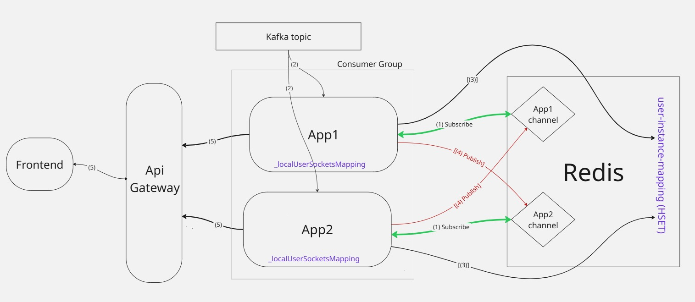

# Realtime Notifications Service

This service is responsible for delivering real-time notifications to the frontend using WebSockets. It consumes events from a Kafka topic and routes them to connected users.

## Architecture

- **.NET 8**: Runtime environment (ASP.NET Core Web API).
- **WebSocket**: Native ASP.NET Core WebSocket middleware for real-time connections.
- **Kafka**: Consumes events from the `orgcarfleet-notifications` topic.
- **Redis**: Used for horizontal scalability (Pub/Sub) to broadcast events across instances.

## Scalability

This service is horizontally scalable. Multiple instances can run simultaneously, all sharing the same Kafka consumer group, which ensures each message is delivered to exactly one instance (only-once delivery).

When an instance consumes a Kafka event:

1. **Local check first**: It checks its local in-memory map to see if the target user is connected to this instance
2. **Redis lookup if needed**: Only if the user is not connected locally, it queries Redis (HGET) to find which instance has the user's WebSocket connection
3. **Redis Pub/Sub routing**: If found, it publishes the message to that specific instance's Redis channel for delivery



## Deployment

**Using deployment script:**

```bash
./scripts/build-and-deploy.sh <command>
```

Available commands:

- `up` - Start all services
- `down` - Stop all services
- `restart` - Restart all services
- `rebuild` - Rebuild and restart all services
- `logs [service]` - Show logs
- `status` - Show service status
- `clean` - Remove all containers, volumes, and images
