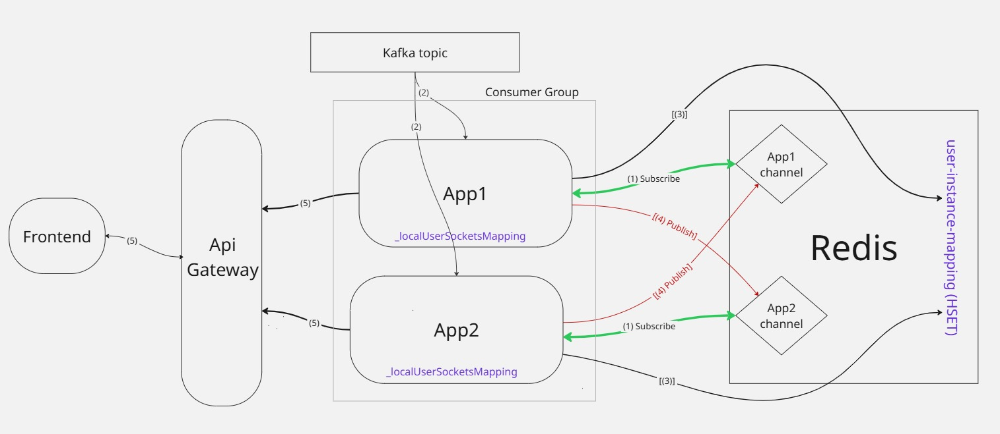

# Realtime Notifications Service

This service is responsible for delivering real-time notifications to the frontend using WebSockets. It consumes events from a Kafka topic and routes them to connected users.

## Architecture

- **.NET 8**: Runtime environment (ASP.NET Core Web API).
- **WebSocket**: Native ASP.NET Core WebSocket middleware for real-time connections.
- **Kafka**: Consumes events from the `orgcarfleet-notifications` topic.
- **Redis**: Used for horizontal scalability (Pub/Sub) to broadcast events across instances.

## Scalability

This service is horizontally scalable. When a Kafka event arrives, the service first checks if the target user is connected locally. If yes, it delivers the message directly via WebSocket. If not, it uses Redis to look up which instance has the user and publishes the message to that specific instance's Redis channel.



## Deployment

**Using deployment script:**

```bash
./scripts/build-deploy.sh <command>
```

Available commands:

- `up` - Start all services
- `down` - Stop all services
- `restart` - Restart all services
- `rebuild` - Rebuild and restart all services
- `logs [service]` - Show logs
- `status` - Show service status
- `clean` - Remove all containers, volumes, and images
